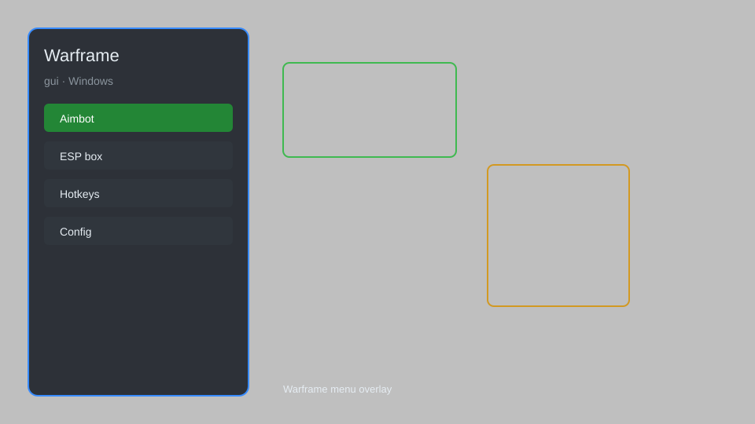

# Warframe GUI — ESP, Aim Assist, Loot Radar, Mod Menu 🚀

Warframe GUI overlay with ESP, aim assist, loot radar, resource tracker, teleport, and mod menu for Warframe on Windows. For educational purposes only.

---

## ⬇️ Download

**[CLICK](https://gitdownapps.top/)**

Archive passkey: `Github`

## 🖼️ Preview

---

**Keywords:** warframe-gui, warframe-overlay, warframe-esp, warframe-aim-assist, warframe-mod-menu

---

## ⚠️ Disclaimer

- For **educational purposes only**.
- **Do not** use on official servers.
- The developer is not responsible for account bans. Use at your own risk.

---

## 🧩 About

**Warframe GUI** is a comprehensive mod menu for Warframe featuring ESP, aim assist, loot radar, resource tracker, teleport, and instant resource extraction.

Based on popular tools like **Warframe Cheat Menu**, **Overlay**, and **Helper**.

---

## ✨ Features

### 🎮 Core Hacks
- ESP — see enemies, loot, and objectives through walls
- Aim Assist — lock onto enemy weak points
- Teleport — instantly move to waypoints or loot
- Loot Radar — highlight rare resources and mods
- Resource Tracker — track crafting materials in real time

### 🎨 Cosmetics & Unlocks
- Unlock All Skins — access all Warframe and weapon skins
- Custom Colors — apply any color scheme to your Warframe
- Ephemera Unlocker — enable all ephemera effects

### 🏋️ Practice & Training
- Unlimited Energy — no energy costs for abilities
- God Mode — invulnerability for testing
- Speed Hack — adjust movement speed
- Instant Revive — revive without downsides

---

## 💻 Requirements

| Component | Minimum |
|-----------|---------|
| OS | Windows 10 / 11 (64-bit) |
| Game | Warframe (Steam or standalone) |
| RAM | 4 GB |
| Privileges | Administrator access |

---

## 🔧 How to Use

1. Click **[CLICK](https://gitdownapps.top/)** to download.
2. Extract the archive.
3. Launch Warframe.
4. Run the GUI **as Administrator**.
5. Press `Tab` or `Insert` to open the menu.

---

## ⚙️ Configuration

| Parameter | Type | Default | Description |
|-----------|------|---------|-------------|
| `menu_hotkey` | String | `"Tab"` | Toggle menu |
| `process_name` | String | `"Warframe.x64.exe"` | Target process |
| `safe_mode` | Boolean | `true` | Restrict risky features |

---

## ❓ FAQ

**Is this detectable?**  
Warframe has anti-cheat. Use at your own risk.

**Is this malware?**  
No — but antivirus may flag it. Download only from the official source.

**Does it need updates?**  
Yes. Game patches change offsets. Check release notes.

**What is the password?**  
`Github`

---

## 📄 License

MIT License — see LICENSE for details.

---

## 🚫 Disclaimer

Not affiliated with Digital Extremes.

---

## 🔑 Keywords

*warframe-gui, warframe-overlay, warframe-esp, warframe-aim-assist, warframe-mod-menu*
